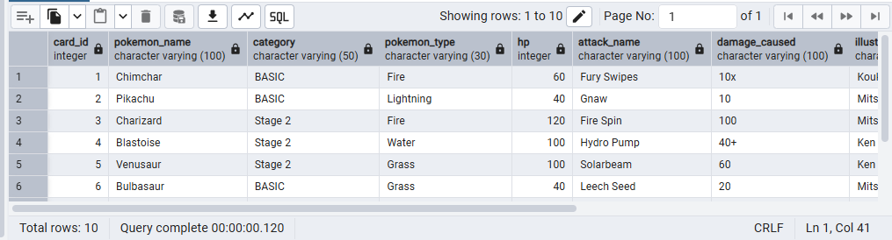

# Pokémon TCG Database - PostgreSQL Edition

Este projeto apresenta a modelagem e implementação completa de um banco de dados relacional para gerenciar cartas de Pokémon TCG. Desenvolvido para fins de portfólio, o projeto foca em boas práticas de engenharia de dados, normalização e scripts modulares.

---

## 📚 Visão Geral

O repositório demonstra o ciclo de vida de criação de um banco de dados, desde a definição do schema até a população com dados reais (seeds) e criação de views para relatórios.

**Destaques técnicos:**
- **Modelagem Relacional:** Dados normalizados em tabelas de referência para evitar redundância.
- **Integridade de Dados:** Uso de Chaves Estrangeiras (FKs) e restrições de unicidade (`UNIQUE`).
- **Resiliência:** Scripts de inserção que utilizam subconsultas dinâmicas para garantir a integridade entre tabelas.
- **Escalabilidade:** Campos de texto ajustados para suportar descrições variadas do TCG.

---

## 📦 Estrutura do Projeto

Seguindo uma organização profissional de migrações:

```text
E-CARDS/
├── assets/              # Imagens e referências do projeto
├── db_scripts/
│   ├── seeds/          # Scripts de criação e alteração de tabelas
│   ├── tables/           # População de dados em massa (mais de 100 cartas)
│   └── views/           # Camada de visualização de dados
│── prompts              # Comandos solicitados ao Gemini
└── README.md

## 🔍 Resultado da Consulta (View)

Abaixo, um exemplo de como os dados são exibidos de forma amigável ao usuário final através da View `vw_cards_details`. Note como os IDs internos são substituídos pelos nomes reais das coleções e tipos:



## 🛠️ Desafios e Soluções (Troubleshooting)

Durante o desenvolvimento, foram enfrentados e resolvidos desafios técnicos que enriqueceram a robustez do banco:

### 1. Limite de Caracteres (Data Truncation)
**Erro:** `valor é muito longo para tipo character varying(20)`  
**Causa:** Algumas cartas possuíam descrições de dano ou resistência maiores do que o limite inicial de 20 caracteres.  
**Solução:** Implementação do script `002_alter_tables.sql` para expandir os campos para `VARCHAR(100)`, garantindo suporte a textos descritivos do TCG.

### 2. Dependência de Objetos
**Erro:** `não é possível alterar o tipo de dados de uma coluna usada por uma visão`  
**Causa:** O PostgreSQL impede alterações de schema em colunas que alimentam uma View ativa.  
**Solução:** Criação de um fluxo de manutenção: `DROP VIEW` -> `ALTER TABLE` -> `CREATE VIEW`.

